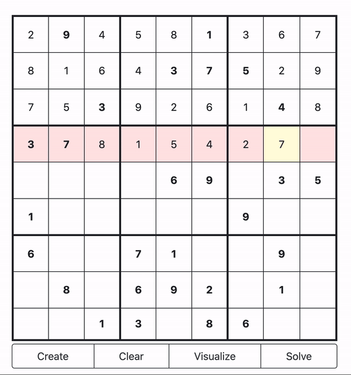

# Sudoku Visualization

The following website is a visualization of a simple backtracking algorithm to solve sudoku. It works by trying each number in the space then moving foward on success, if it can no longer move forward it backtracks to place it can continue

### Demo
https://nathanieljenkins.github.io/sudokuVi/
